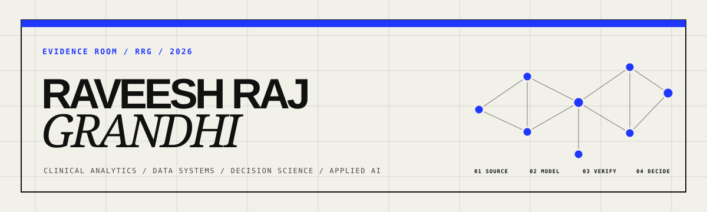

  

  <a href="https://raveesh-rajg.github.io/"><strong>Portfolio</strong></a>
  &nbsp;·&nbsp;
  <a href="https://www.linkedin.com/in/raveeshrajg/"><strong>LinkedIn</strong></a>
  &nbsp;·&nbsp;
  <a href="https://raveesh-rajg.github.io/resume.pdf"><strong>Resume</strong></a>

## I build the evidence path behind the decision.

I am a Clinical Business Analyst II at NYC Health + Hospitals with an M.S. in Health Informatics and an earlier clinical background in dentistry. My work sits where healthcare operations, analytics engineering, business intelligence, decision science, and applied AI meet.

I take a question from source data through modeling, validation, analysis, and a stakeholder-ready interface. Across the repositories below, one rule stays constant: a result should be reproducible, its assumptions should be visible, and its limitations should be stated before anyone acts on it.

## Selected systems

| System | Decision it supports | Proof marker |
| :--- | :--- | :--- |
| **[Hospital Rate Intelligence](https://github.com/Raveesh-rajg/hospital-price-intelligence)** | Where are negotiated hospital rates above a defensible market benchmark? | 93.75% description mapping against a gold crosswalk; 7/7 planted defects quarantined |
| **[Claims Quality & Utilization Lakehouse](https://github.com/Raveesh-rajg/healthcare-claims-pipeline)** | Can utilization and cost metrics be trusted without losing malformed claims? | 98/98 planted defects isolated; clean plus quarantine reconciles exactly to source |
| **[Experiment Decision System](https://github.com/Raveesh-rajg/ab-testing-framework)** | Is a measured lift real, durable, and safe to ship? | Naive peeking reached 24.0% false positives; always-valid mSPRT held at 1.2% |
| **[Governed Analytics Assistant](https://github.com/Raveesh-rajg/analytics-rag-agent)** | Can teams ask the data platform questions without trading speed for governance? | 14/14 routing cases, 8/8 retrieval hit@4, 33 hermetic tests |
| **[AI Spend & Reliability Control](https://github.com/Raveesh-rajg/llm-ops-analytics)** | Which prompts earn their cost, and where does failure waste spend? | 27,683 traced calls; retry anomaly detected at z = 5.3 |
| **[Growth Accounting & Retention](https://github.com/Raveesh-rajg/product-growth-analytics)** | Is activity growth earned through retention or borrowed through acquisition? | 421k events; activated users retained at 45.3% versus 18.2% at week four |

**[Open the full 20-system evidence index →](https://raveesh-rajg.github.io/#archive)**

## How I approach the work

1. **Define the decision.** Name the owner, the choice, and the cost of being wrong.
2. **Engineer the evidence.** Make grain, lineage, exclusions, and quality contracts explicit.
3. **Attack the answer.** Plant defects, compare baselines, test assumptions, and retain failure cases as regression tests.
4. **Make it legible.** Build an interface that clinical, operational, and executive audiences can use confidently.

## Technical range, in context

| Layer | What I use it for |
| :--- | :--- |
| **Analytics and BI** | Tableau, Power BI, DAX, Looker, Looker Studio, Excel, and Power Query for decision-ready reporting |
| **Data and modeling** | SQL, Snowflake, BigQuery, DuckDB, PostgreSQL, dbt, dimensional modeling, and governed semantic layers |
| **Engineering** | Python, pandas, PySpark, Delta Lake, testing, CI, reproducible pipelines, and cloud deployment patterns |
| **Decision science** | Experiment design, frequentist and Bayesian inference, sequential testing, causal inference, forecasting, and cohort analysis |
| **Applied AI** | Retrieval, guarded text-to-SQL, evaluation harnesses, OpenTelemetry tracing, cost-quality analysis, and human-readable provenance |
| **Healthcare context** | Clinical operations, provider performance, claims, utilization, hospital price transparency, and Epic-connected reporting workflows |

## Current focus

At work, I translate clinical and operational questions into trusted dashboards, data workflows, and analyses for leaders across a hospital environment. In the public portfolio, I use reproducible datasets and planted failure modes so the engineering and analytical decisions can be inspected without exposing confidential information.

  <strong>Every highlighted metric is linked to a run, an evaluation, a contract, or a test.</strong> 
  <a href="https://raveesh-rajg.github.io/">Enter the evidence room</a>

